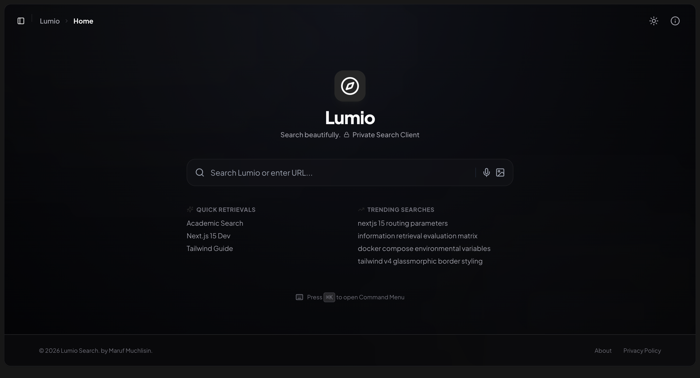
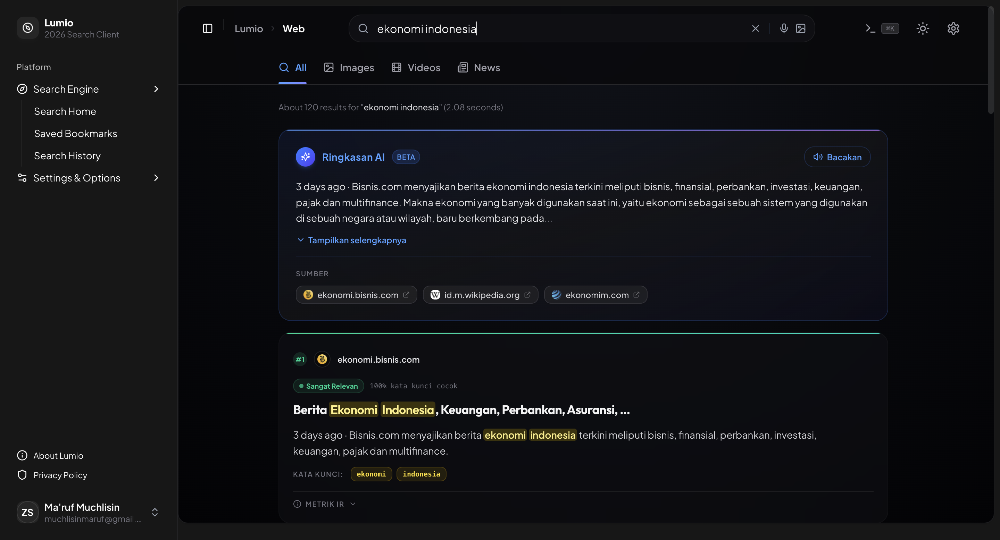
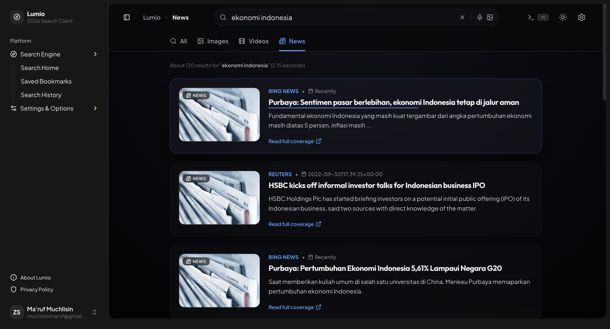
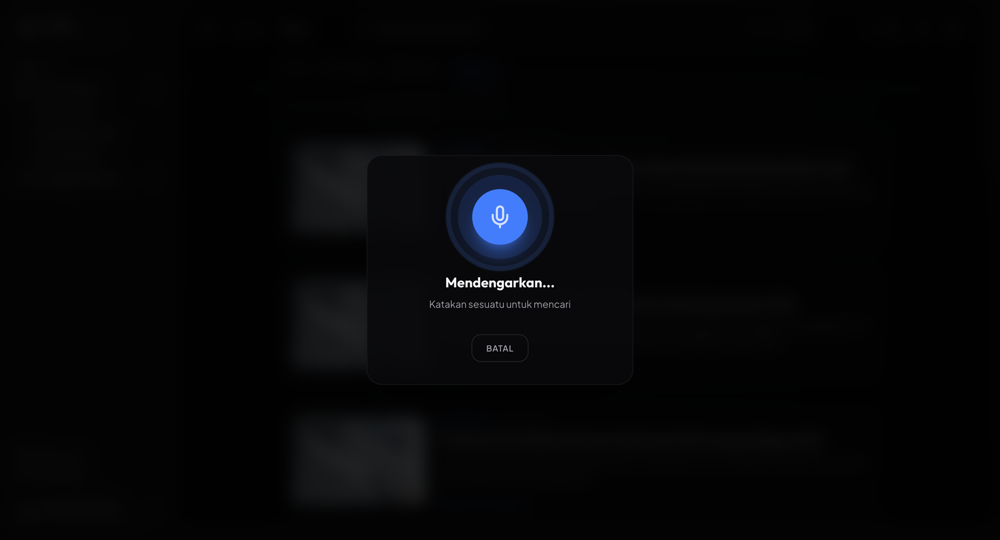

<div align="center">
  
  <br/><br/>

  <h1>🔍 Lumio Search</h1>

  <p><strong>Private, intelligent, and blazing-fast search engine built for the modern web.</strong></p>
  <p>Powered by LumioCore · Built with Next.js 15 · Designed for Information Retrieval Research</p>

  <br/>

  [](https://nextjs.org/)
  [](https://www.typescriptlang.org/)
  [](https://github.com/Mrmarc-bit/lumio)
  [](https://www.docker.com/)
  [](LICENSE)

  <br/>

  [✨ Features](#-features) · [🧠 IR Theory](#-information-retrieval-theory) · [🚀 Quick Start](#-quick-start) · [📸 Screenshots](#-screenshots) · [🛠️ Tech Stack](#️-tech-stack)

  <br/>

  > ⚠️ **Usage Restricted** — Viewing is welcome, but cloning or using this project requires **written permission** from the author. Contact: muchlisinmaruf@gmail.com

</div>

---

## 📖 Overview

**Lumio** adalah mesin pencari modern yang berfokus pada privasi, dikembangkan sebagai proyek **Information Retrieval (IR)** untuk keperluan akademik. Lumio ditenagai oleh **LumioCore** — custom search aggregation engine yang menggabungkan hasil dari berbagai sumber dan memperkayanya dengan algoritma IR modern yang dihitung secara real-time.

> 📚 **Academic Context:** This project was developed for the *Information Retrieval* course to demonstrate real-world IR concepts including TF-IDF, BM25 (Okapi), Cosine Similarity, and Query Coverage — all visualized directly on search result cards.

---

## ✨ Features

### 🔎 Core Search
- **Multi-source aggregation** — menggabungkan hasil dari berbagai sumber secara paralel
- **Realtime search** — hasil diperbarui otomatis 700ms setelah berhenti mengetik
- **Voice search** — overlay full-screen dengan Web Speech API
- **Image search** — upload gambar untuk pencarian visual
- **Tabbed results** — Web · Images · Videos · News dalam satu antarmuka
- **Pagination** — navigasi halaman hasil pencarian
- **Autocomplete** — saran pencarian cerdas saat mengetik

### 🤖 AI Summary (Ringkasan AI)
- **Ringkasan otomatis** dari snippet hasil pencarian teratas — tanpa API eksternal
- **Animasi typewriter** — teks muncul karakter demi karakter layaknya AI
- **Text-to-Speech** — klik "Bacakan" untuk mendengarkan ringkasan
- **Atribusi sumber** — favicon chips yang menautkan ke sumber asli
- **Expandable** — bisa diperluas/diperkecil

### 🎓 Information Retrieval Metrics (Per Result)
Setiap kartu hasil pencarian menampilkan metrik IR yang dihitung secara real-time:

| Metrik | Algoritma | Deskripsi |
|--------|-----------|-----------|
| **BM25** | Okapi BM25 (k₁=1.5, b=0.75) | Probabilistic relevance ranking |
| **TF-IDF** | Term Freq × Inverse Doc Freq | Bobot term di seluruh corpus |
| **cos(θ)** | Cosine Similarity | Sudut antara vektor query & dokumen |
| **Coverage** | Query Coverage % | % kata kunci query yang cocok |
| **TF Table** | Per-term frequency | Frekuensi tiap term query di dokumen |

### 🎨 Premium UI/UX
- **Dark mode** default dengan dukungan light mode
- **Glassmorphism** design language
- **Smooth animations** dengan Framer Motion
- **Knowledge Panel** — infobox bergaya Wikipedia
- **Collapsible sidebar** dengan navigasi, bookmark, dan history
- **Responsive** — dioptimalkan untuk desktop dan mobile
- **Command Palette** — `⌘K` untuk navigasi cepat

### 🔒 Privacy
- **Zero tracking** — semua pencarian diproses melalui backend lokal
- **No external cookies**
- **Local settings** — preferensi disimpan di localStorage browser

---

## 🧠 Information Retrieval Theory

Lumio mengimplementasikan algoritma IR inti dari nol di [`lib/irMetrics.ts`](lib/irMetrics.ts):

### Term Frequency (TF)
$$TF(t, d) = \frac{f_{t,d}}{|d|}$$

Dimana $f_{t,d}$ adalah jumlah kemunculan term $t$ dalam dokumen $d$, dan $|d|$ adalah total panjang dokumen.

### Inverse Document Frequency (IDF)
$$IDF(t, D) = \log\left(\frac{N - df_t + 0.5}{df_t + 0.5} + 1\right)$$

### Okapi BM25
$$BM25(d, q) = \sum_{t \in q} IDF(t) \cdot \frac{f_{t,d} \cdot (k_1 + 1)}{f_{t,d} + k_1 \cdot \left(1 - b + b \cdot \frac{|d|}{avgdl}\right)}$$

Dengan hyperparameter **k₁ = 1.5**, **b = 0.75**.

### Cosine Similarity
$$\cos(\theta) = \frac{\vec{q} \cdot \vec{d}}{|\vec{q}||\vec{d}|}$$

Menggunakan representasi bag-of-words atas vocabulary query-dokumen.

---

## 🚀 Quick Start

### Prerequisites
- **Node.js** 18+
- **Docker** & Docker Compose
- **npm** or **yarn**

### 1. Clone the repository

```bash
git clone https://github.com/Mrmarc-bit/lumio.git
cd lumio
```

### 2. Start LumioCore (search backend)

```bash
docker compose up -d
```

LumioCore search backend will be available at `http://localhost:8080`.

### 3. Configure environment

```bash
cp .env.example .env
```

### 4. Install dependencies & run

```bash
npm install
npm run dev
```

Open [http://localhost:3001](http://localhost:3001) 🎉

---

## 📁 Project Structure

```
lumio/
├── app/
│   ├── api/
│   │   ├── search/          # Search API route — proxied through LumioCore
│   │   └── autocomplete/    # Autocomplete suggestions API
│   ├── search/              # Search results page
│   ├── settings/            # User settings page
│   ├── about/               # About page
│   └── page.tsx             # Homepage
│
├── components/
│   ├── SearchBox.tsx        # Main search input (realtime + voice + image)
│   ├── ResultCard.tsx       # Web result card with IR metrics panel
│   ├── AISummaryCard.tsx    # AI-generated summary from top results
│   ├── InfoboxCard.tsx      # Knowledge panel
│   ├── NewsCard.tsx         # News result card
│   ├── VideoCard.tsx        # Video result card
│   ├── Navbar.tsx           # Top navigation bar with tabs
│   ├── app-sidebar.tsx      # Collapsible sidebar
│   └── nav-user.tsx         # User profile dropdown
│
├── lib/
│   └── irMetrics.ts         # IR algorithms: TF, IDF, BM25, Cosine Similarity
│
├── services/
│   └── search.ts            # LumioCore API service layer
│
├── store/
│   └── searchStore.ts       # Zustand global state (settings, bookmarks, history)
│
└── types/
    └── index.ts             # TypeScript interfaces (WebResult, IRMetrics, etc.)
```

---

## 🛠️ Tech Stack

| Category | Technology |
|----------|-----------|
| **Framework** | Next.js 15 (App Router) |
| **Language** | TypeScript 5 |
| **Styling** | Tailwind CSS v4 |
| **Animations** | Framer Motion |
| **State** | Zustand (with persistence) |
| **UI Components** | Base UI |
| **Search Backend** | LumioCore (custom engine) |
| **Containerization** | Docker Compose |
| **Speech** | Web Speech API (Voice Search + TTS) |

---

## ⚙️ Configuration

### LumioCore Engine Config

```yaml
search:
  default_lang: "id-ID"
  language: "id-ID"
  locale: "id"

engines:
  - name: google
    disabled: false
  - name: bing
    disabled: false
  - name: duckduckgo
    disabled: false
```

### User Settings (in-app)
- 🌐 **Language & Region** — default: Indonesian (`id-ID`)
- 🔒 **Safe Search** — toggle on/off
- 🎨 **Theme** — Light / Dark / System
- 🌈 **Accent Color** — Blue / Purple / Emerald / Amber / Rose

---

## 📸 Screenshots

<div align="center">

### 🔎 Web Search — AI Summary + IR Metrics

<p><em>Hasil pencarian web dengan Ringkasan AI, keyword highlighting, label relevansi, dan panel Metrik IR yang menampilkan BM25, TF-IDF, Cosine Similarity & Query Coverage.</em></p>

<br/>

### 📰 News Tab

<p><em>Agregasi berita real-time dari berbagai sumber — berita Indonesia yang relevan disajikan dengan label sumber, timestamp, dan thumbnail.</em></p>

<br/>

### 🎤 Voice Search Overlay

<p><em>Overlay perekaman suara full-screen dengan animasi mikrofon — berbasis Web Speech API untuk pencarian tanpa tangan.</em></p>

</div>

---

## 🎯 IR Metrics in Action

Setiap kartu hasil pencarian di Lumio menampilkan:

```
#1 ● Sangat Relevan    100% kata kunci cocok
━━━━━━━━━━━━━━━━━━━━━━━━━━━━━━━━━━━━━━━━━

📄 Result Title Here
   Snippet text with highlighted keyword matches...

🔑 KATA KUNCI:  cara   menghilangkan   iklan

▼ METRIK IR
  BM25  ████████████░  0.847    Okapi BM25 probabilistic ranking
  TF-IDF ██████████░░  0.712    Term frequency × inverse doc freq
  cos(θ) █████████░░░  0.634    Cosine similarity (bag-of-words)
  Coverage ████████████  100%   3 of 3 terms matched
```

---

## 👤 Author

**Ma'ruf Muchlisin**
- 📧 Email: [muchlisinmaruf@gmail.com](mailto:muchlisinmaruf@gmail.com)
- 🐙 GitHub: [@Mrmarc-bit](https://github.com/Mrmarc-bit)

---

## 📄 License

This project is licensed under the **MIT License** — see the [LICENSE](LICENSE) file for details.

---

<div align="center">
  <p>Made with ❤️ for the Information Retrieval Course · 2026</p>
  <p><strong>Lumio Search</strong> — Search beautifully. 🔒 Private Search Client</p>
</div>
