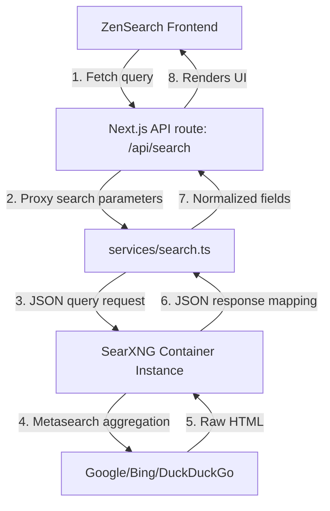

# Developer Documentation - ZenSearch

This document explains the architecture, folder structure, state management, and provider abstractions inside ZenSearch for developers wishing to extend the project.

---

## Directory Structure

```
├── app/                     # Next.js 15 App Router Routes
│   ├── api/                 # API endpoint handlers (/search and /autocomplete)
│   ├── search/              # Search results view page
│   ├── settings/            # User settings, bookmarks, and collections dashboard
│   ├── globals.css          # Main Tailwind styles
│   └── layout.tsx           # Global Root layout
├── components/              # Reusable React components (ResultCard, Sidebar, etc.)
├── docs/                    # Installation, Deployment and Developer guides
├── searxng/                 # SearXNG configuration settings mounting
├── services/                # Search API provider abstraction layer
├── store/                   # Zustand local state management store
├── types/                   # TypeScript interface types schemas
└── docker-compose.yml       # Docker orchestrator
```

---

## Architecture & Data Flow

ZenSearch separates the user interface layer from the search engine scraper proxy layer.



### 1. The Provider Abstraction (`services/search.ts`)
The `searchService` object encapsulates requests to the SearXNG metasearch API.
If SearXNG is unreachable (e.g. offline development or rate-limiting block), it captures the exception and returns high-quality mock data structure so development does not break.

Functions provided:
- `search(query, page, safeSearch, lang, country)`: For general web searches. Maps SearXNG results fields (`title`, `url` as `link`, `content` as `snippet`).
- `imageSearch(query, page)`: Maps image results (`img_src` or `thumbnail` to `src`).
- `newsSearch(query, page)`: Maps news items (`publishedDate` as `date`, `source` to publisher).
- `videoSearch(query, page)`: Maps video metadata, including inline YouTube player identifier parsing.
- `autocomplete(query)`: Maps query query suggestions (proxied to Google suggest API for maximum coverage).

### 2. State Management (`store/searchStore.ts`)
ZenSearch uses **Zustand** coupled with the `persist` middleware to persist state locally on the user's browser inside `localStorage`.

State features:
- **SearchSettings**: Compact mode toggles, Safe Search triggers, Theme parameters (light/dark/system), languages, and Accent themes.
- **Bookmarks**: An array of `WebResult` entries that the user saves.
- **Collections**: Custom named bookmark folders.
- **RecentSearches**: Maintains a history of queries.

### 3. Dynamic Design Accent Colors
Accent theme colors (blue, purple, emerald, amber, rose) are bound via a custom Tailwind variable `--color-accent` mapped inside the document root element styles. The state store dynamically updates `--color-accent` on load or theme switches:
```typescript
root.style.setProperty('--color-accent', accentHex);
```
This lets developers style any child component with `bg-accent` or `text-accent` directly.
